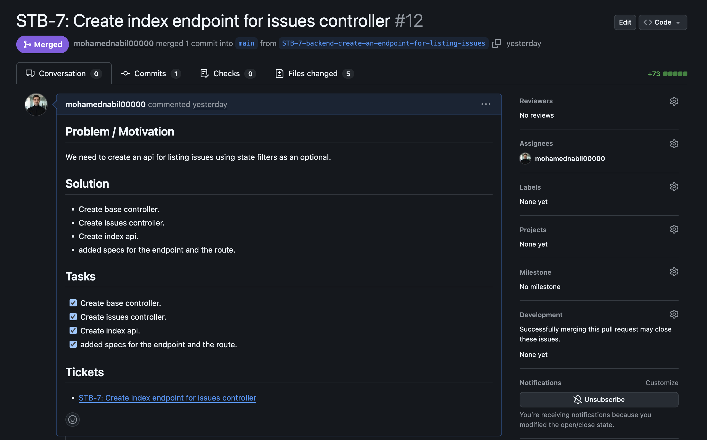
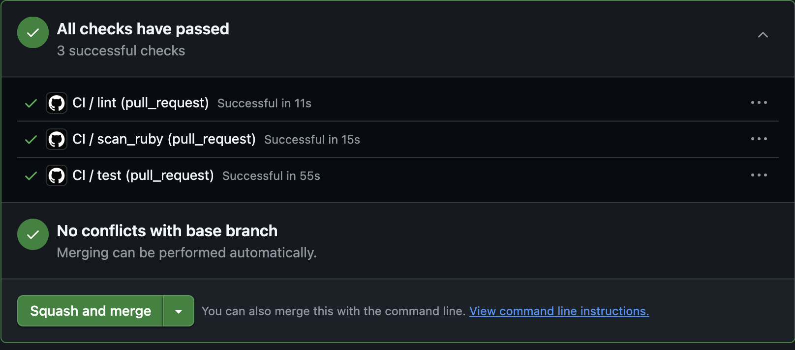
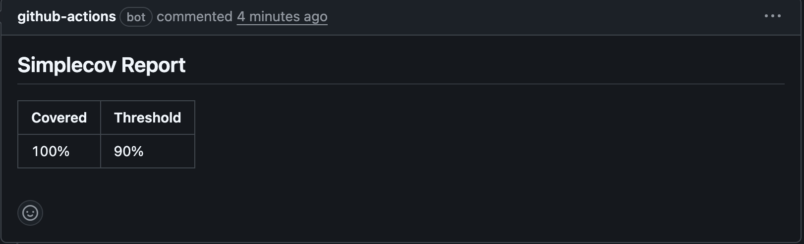
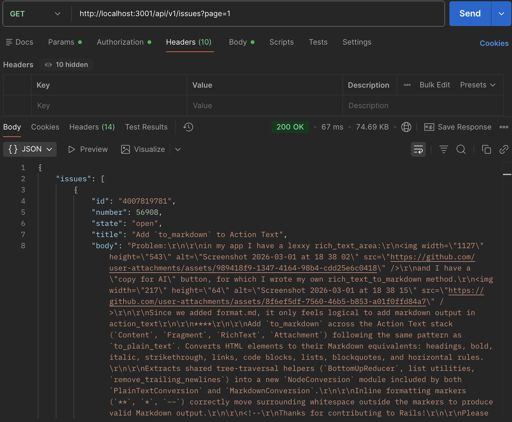
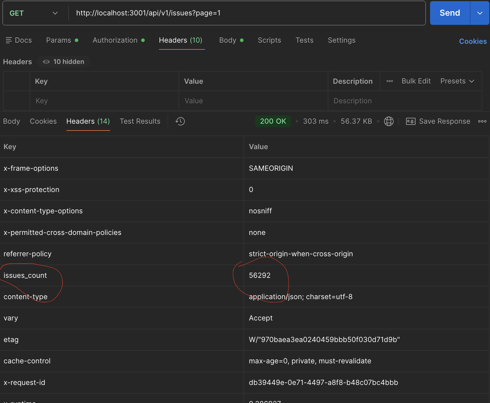

## Backend Test Task – Rails API

Small Rails 8 API that synchronizes GitHub issues from the `rails/rails` repository, stores them in Postgres, and exposes them via a paginated JSON API.

### Tech stack
- **Ruby**: 4.0.1  
- **Rails**: 8.1  
- **Database**: PostgreSQL  
- **Background jobs**: Sidekiq + Redis  
- **Pagination**: Pagy (keyset)  
- **Tests**: RSpec

---

### 1. Local setup (without Docker)

**Prerequisites**
- Ruby 4.0.1 installed (e.g. via `rbenv` or `rvm`)
- PostgreSQL running locally
- Redis running locally
- Sidekiq running locally

**Install dependencies**

```bash
bundle install
```

**Configure database**

Create the development and test databases in Postgres:

- `backend_test_development`
- `backend_test_test`

Either:
- Export `DATABASE_URL` / standard Rails env vars, **or**
- Edit `config/database.yml` to match your local credentials.

Then run:

```bash
bin/rails db:setup   # or: bin/rails db:create db:migrate db:seed
```

**Run the test suite**

```bash
bundle exec rspec
```

**Run the server**

```bash
bin/rails server
```

API will be available at `http://localhost:3000`.

---

### 2. Running with Docker / Docker Compose

From the project root:

```bash
docker compose -f docker-compose.yml up --build
```

This will start:
- `web` (Rails API) on port **3001**
- `db` (Postgres)
- `redis`
- `sidekiq` (background jobs)

Once up, the API will be reachable at `http://localhost:3001`.

---

### 3. Background synchronization job

The job responsible for fetching and storing GitHub issues is:

- `GithubIssuesSynchronizerJob`

It:
- Reads the last processed GitHub issue ID from Redis (`last_issue_id`)
- Fetches issues from the GitHub API via `Github::RailsRepo::Client`
- Parses the payload with `GithubRepoData::ParsingService`
- Persists users and issues with `GithubRepoData::PersistingService`
- Updates `last_issue_id` in Redis

You can enqueue it from the Rails console:

```ruby
GithubIssuesSynchronizerJob.perform_now
```

Sidekiq must be running (see Docker section or run it locally with `bundle exec sidekiq`).

---

### 4. Issues API

**Endpoint**

```text
GET /api/v1/issues
```

**Query params**
- `state` – optional, filter by GitHub issue state (e.g. `open`, `closed`)

**Response body**
- `issues` – serialized issues with associated user
- `metadata` – Pagy pagination metadata (keyset-based)

**Response header**
- `issues_count` – number of total issues in DB

Example:

```json
{
  "issues": [
    {
      "id": "123",
      "number": 1,
      "state": "open",
      "title": "Issue title",
      "body": "Issue body",
      "user": {
        "id": 1,
        "login": "user1",
        "avatar_url": "https://example.com/avatar",
        "url": "https://api.github.com/users/user1",
        "type": "User"
      },
      "created_at": "2024-01-01T00:00:00Z",
      "updated_at": "2024-01-02T00:00:00Z"
    }
  ],
  "metadata": {
    "...": "pagy metadata fields"
  }
}
```

---

### 5. Screenshots

- **GitHub pull request description template**

  

- **CI jobs (lint, security scan, tests)**

  

- **Code coverage (SimpleCov report)**

  

- **Api Call for listing issues**

  

  - **Total count of issues in response header**

  

---

### 6. Useful commands

- **Run tests**
  ```bash
  bundle exec rspec
  ```

- **Run RuboCop**
  ```bash
  bundle exec rubocop
  ```

- **Run Sidekiq (non‑Docker)**
  ```bash
  bundle exec sidekiq
  ```

